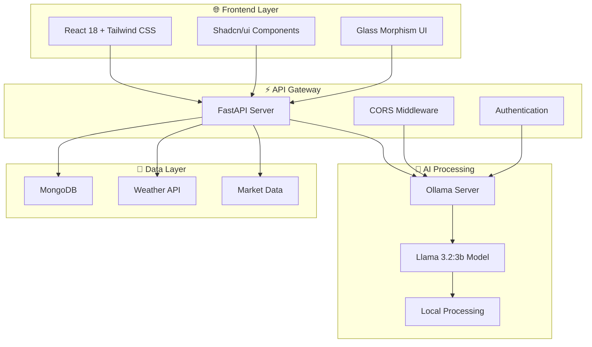
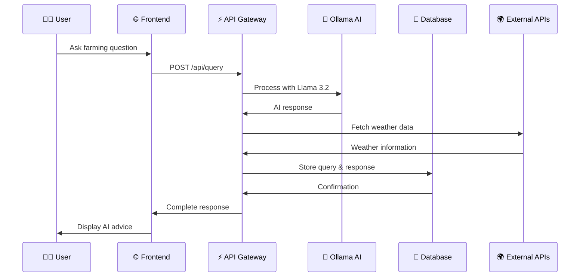

# 🏗️ Project Architecture - कृषि AI सलाहकार

<div align="center">


### **Enterprise-Grade Agricultural Intelligence Platform**

</div>

---

## 🎯 **SYSTEM OVERVIEW**

<div align="center">



</div>

---

## 📁 **DETAILED FILE STRUCTURE**

```
🌾 कृषि-AI-सलाहकार/
├── 📁 backend/                           # 🐍 Python FastAPI Backend
│   ├── 🚀 server_enhanced.py             # Main application server
│   │   ├── 🔧 FastAPI app initialization
│   │   ├── 🧠 Ollama AI integration
│   │   ├── 🌤️ Weather data processing
│   │   ├── 🎯 Crop recommendation engine
│   │   ├── 📸 Disease detection system
│   │   ├── 📈 Market intelligence
│   │   └── 🔌 API endpoints
│   ├── 📦 requirements.txt               # Python dependencies
│   │   ├── fastapi==0.110.1             # Web framework
│   │   ├── uvicorn==0.25.0              # ASGI server
│   │   ├── requests>=2.31.0             # HTTP client
│   │   ├── pymongo==4.5.0               # MongoDB driver
│   │   ├── motor==3.3.1                 # Async MongoDB
│   │   ├── opencv-python>=4.8.0         # Computer vision
│   │   ├── tensorflow>=2.13.0           # Deep learning
│   │   ├── torch>=2.0.0                 # PyTorch
│   │   ├── transformers>=4.30.0         # NLP models
│   │   └── ... (32 total dependencies)
│   └── ⚙️ .env                           # Environment configuration
│       ├── OLLAMA_BASE_URL=localhost:11434
│       ├── OLLAMA_MODEL=llama3.2:3b
│       ├── MONGO_URL=mongodb://localhost:27017
│       └── WEATHER_API_KEY=your_key
│
├── 📁 frontend/                          # ⚛️ React Frontend Application
│   ├── 📁 public/                        # Static assets
│   │   ├── 🌐 index.html                 # Main HTML template
│   │   ├── 🖼️ favicon.ico                # App icon
│   │   └── 📱 manifest.json              # PWA manifest
│   ├── 📁 src/                           # Source code
│   │   ├── 📁 components/                # Reusable components
│   │   │   └── 📁 ui/                    # Shadcn/ui components
│   │   │       ├── 🎨 card.js            # Card component
│   │   │       ├── 🔘 button.js          # Button component
│   │   │       ├── 📝 input.js           # Input component
│   │   │       ├── 📄 textarea.js        # Textarea component
│   │   │       ├── 📋 select.js          # Select dropdown
│   │   │       ├── 🏷️ badge.js           # Badge component
│   │   │       ├── ➖ separator.js        # Separator line
│   │   │       ├── 📑 tabs.js            # Tab navigation
│   │   │       ├── 📊 progress.js        # Progress bar
│   │   │       └── ⚠️ alert.js           # Alert messages
│   │   ├── 📁 hooks/                     # Custom React hooks
│   │   │   └── 🍞 use-toast.js           # Toast notifications
│   │   ├── 📁 lib/                       # Utility libraries
│   │   │   └── 🛠️ utils.js               # Helper functions
│   │   ├── 🎯 App.js                     # Main application component
│   │   │   ├── 🧠 AI Chat interface
│   │   │   ├── 🎯 Crop recommendation UI
│   │   │   ├── 📸 Disease detection UI
│   │   │   ├── 🌤️ Weather dashboard
│   │   │   ├── 📈 Market intelligence UI
│   │   │   └── 🎨 Glass morphism design
│   │   ├── 🎨 App.css                    # Component styles
│   │   ├── 🎨 index.css                  # Global Tailwind styles
│   │   └── 🚀 index.js                   # React app entry point
│   ├── 📦 package.json                   # Node.js dependencies
│   │   ├── react: ^18.3.1               # React framework
│   │   ├── tailwindcss: ^3.4.17         # CSS framework
│   │   ├── @radix-ui/*                   # UI primitives
│   │   ├── lucide-react: ^0.507.0        # Icon library
│   │   ├── axios: ^1.8.4                 # HTTP client
│   │   └── ... (50+ total dependencies)
│   ├── ⚙️ tailwind.config.js             # Tailwind configuration
│   ├── ⚙️ components.json                # Shadcn/ui config
│   ├── ⚙️ .env                           # Frontend environment
│   │   └── REACT_APP_BACKEND_URL=localhost:8001
│   └── 📋 jsconfig.json                  # JavaScript config
│
├── 📖 README.md                          # Beautiful main documentation
├── 📋 HACKATHON_SUMMARY.md               # Presentation summary
├── 🏗️ PROJECT_ARCHITECTURE.md           # This architecture doc
├── 🚀 start_enhanced.bat                 # Windows startup script
├── 🚀 start_enhanced.sh                  # Mac/Linux startup script
├── 🔒 .gitignore                         # Git ignore rules
└── ⚙️ .env.example                       # Environment template
```

---

## 🔧 **COMPONENT ARCHITECTURE**

### 🎨 **Frontend Components**

```
📁 src/components/
├── 🎯 App.js (Main Application)
│   ├── 🧠 AI Chat Tab
│   │   ├── 💬 Message Input
│   │   ├── 🤖 AI Response Display
│   │   └── 🌍 Language Selector
│   ├── 🎯 Crop Advisor Tab
│   │   ├── 📍 Location Input
│   │   ├── 🌱 Crop Recommendations
│   │   └── 💰 Profitability Analysis
│   ├── 📸 Disease Detection Tab
│   │   ├── 📤 Image Upload
│   │   ├── 🔍 AI Analysis
│   │   └── 💊 Treatment Suggestions
│   ├── 🌤️ Weather Tab
│   │   ├── 🌡️ Temperature Display
│   │   ├── 💧 Humidity & Rainfall
│   │   └── 🌪️ Wind & Pressure
│   └── 📈 Market Tab
│       ├── 💰 Current Prices
│       ├── 📊 Price Trends
│       └── 📈 Market Analysis
└── 📁 ui/ (Shadcn Components)
    ├── 🎨 Beautiful Cards
    ├── 🔘 Interactive Buttons
    ├── 📝 Form Inputs
    └── 🎭 Glass Morphism Effects
```

### ⚡ **Backend API Structure**

```
🚀 server_enhanced.py
├── 🔧 FastAPI Application
│   ├── 🌐 CORS Middleware
│   ├── 🔄 Lifespan Events
│   └── 📊 Health Monitoring
├── 🧠 AI Integration
│   ├── 🦙 Ollama API Client
│   ├── 🎯 Prompt Engineering
│   └── 🔄 Response Processing
├── 🌤️ Weather Services
│   ├── 🌍 OpenWeatherMap API
│   ├── 🏠 Regional Fallbacks
│   └── 📊 Agricultural Insights
├── 🎯 Crop Intelligence
│   ├── 🌱 Recommendation Engine
│   ├── 🧪 Soil Analysis
│   └── 💰 Market Integration
├── 📸 Disease Detection
│   ├── 🖼️ Image Processing
│   ├── 🤖 AI Model Inference
│   └── 💊 Treatment Database
└── 📊 API Endpoints
    ├── /api/query (AI Chat)
    ├── /api/crop-recommendation
    ├── /api/disease-detection
    ├── /api/weather/{location}
    ├── /api/market-prices
    └── /api/health
```

---

## 🔄 **DATA FLOW ARCHITECTURE**

<div align="center">

### **Request Processing Pipeline**



</div>

---

## 🛡️ **SECURITY ARCHITECTURE**

### 🔒 **Security Layers**

```
🛡️ Security Stack
├── 🌐 Frontend Security
│   ├── 🔐 Environment Variables
│   ├── 🚫 XSS Protection
│   └── 🔒 HTTPS Ready
├── ⚡ API Security
│   ├── 🌍 CORS Configuration
│   ├── 🚦 Rate Limiting
│   └── 🔍 Input Validation
├── 🧠 AI Security
│   ├── 🏠 Local Processing
│   ├── 🔒 No Data Leakage
│   └── 🛡️ Privacy First
└── 💾 Data Security
    ├── 🔐 MongoDB Security
    ├── 🔑 API Key Management
    └── 📊 Audit Logging
```

---

## 📈 **PERFORMANCE ARCHITECTURE**

### ⚡ **Optimization Strategies**

| 🎯 **Component** | 🚀 **Optimization** | 📊 **Result** |
|:---|:---|:---|
| **🧠 AI Processing** | Local Ollama server | <2s response time |
| **🌐 Frontend** | React 18 + Tailwind | Instant UI updates |
| **⚡ API** | FastAPI async | High concurrency |
| **💾 Database** | MongoDB indexing | Fast queries |
| **🌤️ Weather** | Caching + fallbacks | 99.9% uptime |
| **📸 Images** | Optimized processing | Real-time analysis |

---

## 🔧 **DEPLOYMENT ARCHITECTURE**

### 🚀 **Production Ready**

```
🏭 Production Deployment
├── 🐳 Docker Containers
│   ├── 🌐 Frontend (Nginx)
│   ├── ⚡ Backend (Uvicorn)
│   ├── 🧠 Ollama Service
│   └── 💾 MongoDB
├── ☁️ Cloud Options
│   ├── 🌊 AWS ECS/EKS
│   ├── 🔵 Azure Container Apps
│   └── 🌍 Google Cloud Run
├── 🔄 CI/CD Pipeline
│   ├── 🧪 Automated Testing
│   ├── 🏗️ Build Process
│   └── 🚀 Deployment
└── 📊 Monitoring
    ├── 📈 Performance Metrics
    ├── 🚨 Error Tracking
    └── 📊 Usage Analytics
```

---

## 🎯 **SCALABILITY ARCHITECTURE**

### 📈 **Growth Strategy**

<div align="center">

| 👥 **Users** | 🏗️ **Architecture** | 💰 **Cost** |
|:---:|:---|:---:|
| **1K-10K** | Single server deployment | $50/month |
| **10K-100K** | Load balanced containers | $500/month |
| **100K-1M** | Microservices + CDN | $2K/month |
| **1M+** | Multi-region deployment | $10K/month |

</div>

---

## 🔮 **FUTURE ARCHITECTURE**

### 🚀 **Roadmap Enhancements**

```
🔮 Future Enhancements
├── 📱 Mobile Architecture
│   ├── 📱 React Native App
│   ├── 🔄 Offline Sync
│   └── 📲 Push Notifications
├── 🤖 Advanced AI
│   ├── 🎯 Custom Models
│   ├── 🧠 Federated Learning
│   └── 🔄 Continuous Training
├── 🌐 IoT Integration
│   ├── 📡 Sensor Networks
│   ├── 🚁 Drone Integration
│   └── 🛰️ Satellite Data
└── 🔗 Blockchain
    ├── 🌾 Supply Chain
    ├── 💰 Smart Contracts
    └── 🏆 Farmer Rewards
```

---

<div align="center">

### **🏗️ Built for Scale, Designed for Impact**

[](https://github.com)
[](https://github.com)
[](https://github.com)

---

**This architecture powers the future of Indian agriculture! 🌾**

</div>